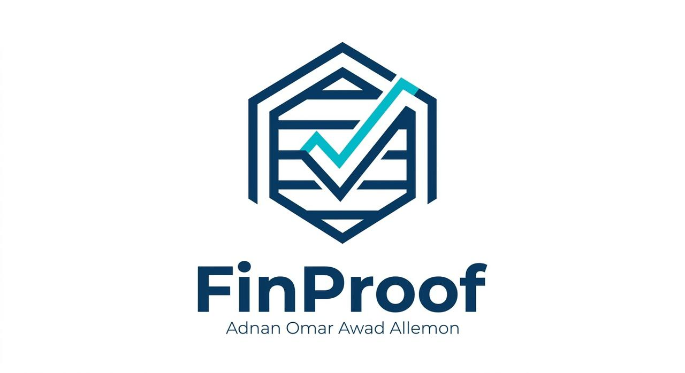

# FinProof`r`n`r`n`r`n`r`n**Created by Adnan Omar Awad Allemon**

## Deterministic Financial Programming Language

**Created by Adnan Omar Awad Allemon**

FinProof is an independent domain-specific programming language for deterministic financial transactions, double-entry accounting, ledger execution, financial invariants, and execution verification.

## Version

**0.1.0**

## Language Pipeline

Source ? Lexer ? Parser ? Type Checker ? Compiler ? Bytecode ? VM ? Ledger ? Verification

## Example

``text
currency USD

account Cash: asset USD = 1000
account SalesRevenue: revenue USD = 0

transaction Sale {
    debit Cash 100 USD
    credit SalesRevenue 100 USD
}
``

